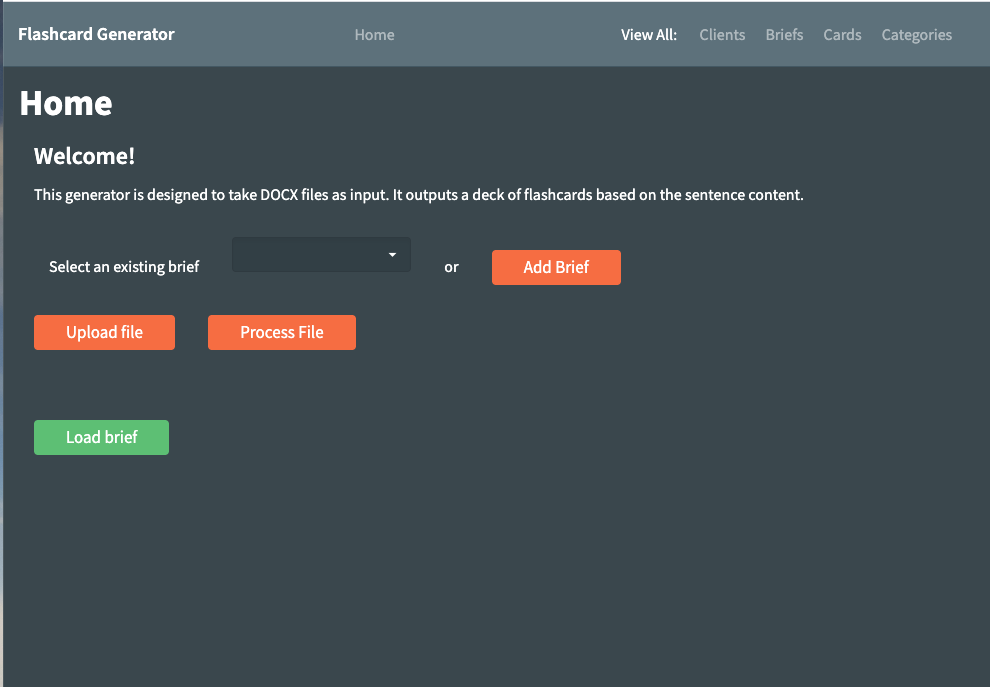
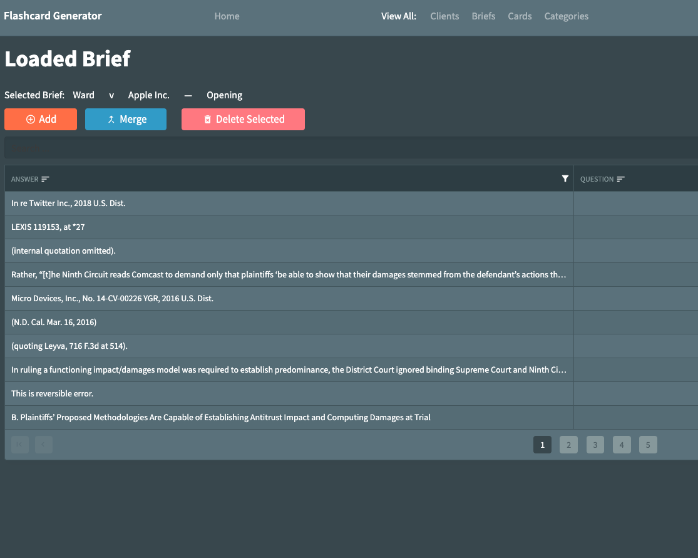

# OrrickFlashcards

 

This is the first iteration of the 2020 version of the Orrick Flashcard Generator. 

To use this it's best to have Visual Studio and the latest .NET SDK for [Blazor](https://dotnet.microsoft.com/apps/aspnet/web-apps/blazor).

## Steps to Deploy
1. Create SQL database (model with demo data provided at Orrick.SQL)
2. Update SQL database connection string at /server/appsettings.json:10
3. Update Aspose license by adding license as Embedded Resource in Visual Studio and adjusting /server/Startup.cs:105
4. For more on Deployment, see the [Blazor docs](https://docs.microsoft.com/en-us/aspnet/core/blazor/host-and-deploy/server?view=aspnetcore-5.0)

## What works
- Upload workflow
- Basic "Dumb" Segmentation
- Editing, Adding and deleting Cards, Clients, Briefs, and Categories (for cards)
- Export card to DOCX table

## To Do
- Merge button *(function at /server/Pages/LoadedBrief.razor.cs:28)*
- Multiple delete button *(function at /server/Pages/LoadedBrief.razor.cs:56)*
- Format flashcards export document to match previous Orrick flashcard documents *(function at /server/Pages/LoadedBrief.razor.cs:78*
- The Sentences object model was created for future feature extension. I would anticipate this looking like an associate parsing through Sentences first and then creating Cards from the edited table. This would look like modifying the document parsing function at /server/Pages/Home.razor.cs:42.
	* Sentences
		* sentenceId (int)
		* briefId (num) (FOREIGN KEY)
		* content (string)
- Expanding PragmaticSegmeter
	- Due to bandwidth constraints, I wasn't able to add any additional rules to [PragmaticSegmenter](https://github.com/UglyToad/PragmaticSegmenterNet). Segmenter should be extended and the reference at /server/Pages/Home.razor.cs:32 changed as necessary.

	
### Object Models
	
This project utilizes the following object models:

* Briefs
	* briefId (int) (KEY)
	* clientId (int) (FOREIGN KEY)
	* isTestBrief? (bool)
	* opposingParty (string)
* Cards
	* cardId (int) (KEY)
	* briefId (int) (FOREIGN KEY)
	* Answer (string)
	* Question (string)
	* Verified (bool)
	* categoryId (int) (FOREIGN KEY)
* Categories
	* categoryId (int) (KEY)
	* name (string)
* Clients
	* clientId (int) (KEY)
	* longName (string)
	* shortName (string)
	* isCurrent (bool) 	

### References
- [Aspose.Words](https://apireference.aspose.com/words/net)
- [Radzen](https://www.radzen.com/documentation/) (so helpful)
- [PragmaticSegmenterNet](https://github.com/UglyToad/PragmaticSegmenterNet)

### Special Thanks
To Manyee, Melanie, Dan, Blake, and Ben

#### Credit
Designed by Carter Liebman, 2021
